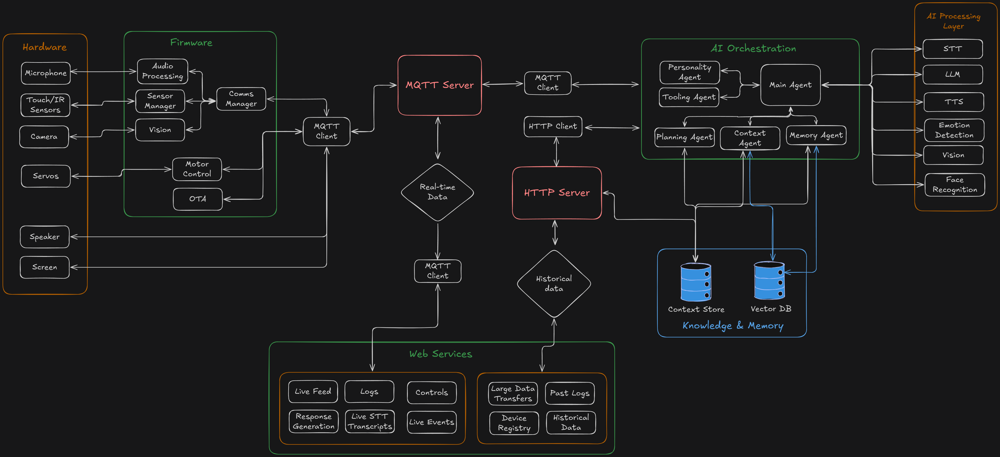

# NAILA Desk Robot

Small custom built desk AI robot prototype.

## Table of Contents

1.  [About the Project](#about-the-project)
2.  [Features & Capabilities](#features--capabilities)
3.  [System Architecture](#system-architecture)
4.  [Hardware Overview](#hardware-overview)
5.  [Software Components](#software-components)
6.  [Future Enhancements](#future-enhancements)
7.  [Copyright & Licensing](#7-copyright--licensing)

---

## 1. About the Project

This project aims to build a personalized AI companion robot inspired by devices like EMO or Vector. The goal is to create an interactive and intelligent robot that lives on your desk, providing companionship, entertainment, and utility, all powered by local, privacy-focused AI.

By leveraging powerful local AI models and efficient communication protocols, NAILA aims to offer a low-latency, responsive experience without constant reliance on cloud services for the time being.

## 2. Features & Capabilities

NAILA as a robot is designed to offer a range of intelligent and interactive features:

* **Natural Language Understanding (NLU) & Conversation:**
    * **Wake Word Detection:** Responds to a custom wake word to initiate interaction.
    * **Speech-to-Text (STT):** Transcribes spoken commands and queries into text using **`faster-whisper`** (running a `tiny.en` or `base.en` Whisper model).
    * **Large Language Model (LLM) Processing:** Engages in dynamic, intelligent conversations and answers questions using a local LLM (**Llama 3 8B Instruct** via `llama-cpp-python`).
    * **Text-to-Speech (TTS):** Generates natural-sounding voice responses using the **`Llama-OuteTTS-1.0-1B-GGUF`** model (also powered by `llama-cpp-python`), allowing for unique voice characteristics via speaker referencing.

* **Interactive Presence:**
    * **Expressive Display:** Utilizes an integrated screen for animated eyes, expressions, and on-screen information.
    * **Motorized Movements:** Enables head tilts, body movements, and other gestures to convey emotion and attention.
    * **Responsive Audio:** Plays sounds and speaks directly to the user.

* **Environmental Awareness:**
    * **Basic Vision Processing:** Utilizes a camera for basic object detection and recognition using **`Ultralytics YOLOv8 Nano`**. This can enable the robot to identify people, pets, or specific objects in its vicinity.

* **Maintainability & Updates:**
    * **Over-The-Air (OTA) Firmware Updates:** Allows for easy wireless updates to the robot's embedded firmware directly from the local server.

## 3. System Architecture

)

NAILA's architecture is designed as a distributed system with clear separation of concerns across hardware, firmware, communication layers, and AI processing components.

### Core Architecture Components:

**Hardware Layer:**
- **Input Devices:** Microphone array, Touch/IR sensors, Camera
- **Output Devices:** Speaker with amplification, Expressive screen/display
- **Actuators:** Servo motors for movement and gestures

**Firmware Layer (ESP32-S3):**
- **Audio Processing:** Real-time audio capture and preprocessing
- **Sensor Manager:** Handles touch, IR, and environmental sensors
- **Vision Processing:** Basic computer vision tasks and camera management
- **Motor Control:** Servo positioning and movement coordination
- **Communications Manager:** WiFi connectivity and protocol handling
- **OTA Updates:** Over-the-air firmware update capability

**Communication Infrastructure:**
- **MQTT Server:** Central message broker for asynchronous communication
- **HTTP Server:** Web services for data access, logs, and device management
- **Real-time Data Flow:** Bidirectional communication between all components

**AI Orchestration Layer:**
- **Main Agent:** Primary decision-making and conversation flow control
- **Personality Agent:** Manages character traits and behavioral responses
- **Context Agent:** Maintains conversation context and situational awareness
- **Memory Agent:** Handles long-term memory and user personalization
- **Planning Agent:** Task planning and goal-oriented behavior
- **Tooling Agent:** Integration with external tools and services

**AI Processing Pipeline:**
- **Speech-to-Text (STT):** Audio transcription using Whisper models
- **Large Language Model (LLM):** Natural language understanding and generation
- **Text-to-Speech (TTS):** Voice synthesis with personality characteristics
- **Computer Vision:** Object detection, face recognition, and visual analysis
- **Emotion Detection:** Facial expression and sentiment analysis

**Knowledge & Memory Systems:**
- **Context Store:** Short-term conversation and interaction context
- **Vector Database:** Long-term memory storage with semantic search capabilities

**Web Services Interface:**
- **Live Feed:** Real-time robot status and sensor data
- **Device Controls:** Remote robot control and configuration
- **Historical Data:** Logs, interaction history, and analytics
- **Response Generation:** AI model outputs and processing logs

## 4. Hardware Overview

* **Main Microcontroller:** ESP32-S3 Sense (chosen for its AI capabilities, camera, and voice processing peripherals).
* **Camera:** Integrated with ESP32-S3 Sense.
* **Display:** Small, expressive display (e.g., SPI or I2C LCD/OLED) for facial animations and information.
* **Audio Input:** Microphone array (e.g., PDM mic on ESP32-S3 Sense board).
* **Audio Output:** Speaker with amplifier.
* **Motors:** Small servo motors for head/body articulation.
* **Power:** Battery-powered with charging circuit (details to be defined).

## 5. Software Components

The project is architected as a distributed system with three main software domains:

### `firmware/` (Robot Embedded Code)
This directory contains the C++/PlatformIO code that runs directly on the ESP32-S3 Sense board.

**Core Modules:**
* **Audio Processing Module:** Real-time audio capture, noise reduction, and preprocessing
* **Sensor Manager:** Unified interface for touch sensors, IR sensors, and environmental monitoring
* **Vision Module:** On-device computer vision processing and camera management
* **Motor Control System:** Servo coordination, movement patterns, and gesture execution
* **Communications Manager:** WiFi connectivity, MQTT client, and protocol handling
* **OTA Update Handler:** Secure over-the-air firmware update capability

**Key Responsibilities:**  
* Hardware abstraction and low-level device control
* Real-time sensor data collection and processing
* Local preprocessing to reduce server computational load
* Reliable communication with the AI orchestration layer
* Safety-critical motor control and hardware protection

**Further Details:** See [firmware/README.md](firmware/README.md)

### `server/` (AI Orchestration & Processing Server)
This directory contains the Python-based multi-agent system that runs on a more powerful machine on your local network.

**Agent Architecture:**
* **Main Agent:** Central coordinator managing conversation flow and high-level decision making
* **Personality Agent:** Maintains character consistency, emotional responses, and behavioral traits
* **Context Agent:** Tracks conversation context, user preferences, and situational awareness
* **Memory Agent:** Manages long-term memory, user relationships, and experience storage
* **Planning Agent:** Handles goal setting, task decomposition, and multi-step action planning
* **Tooling Agent:** Integrates external APIs, smart home controls, and utility functions

**AI Processing Pipeline:**
* **Speech-to-Text (STT):** `faster-whisper` with optimized Whisper models (tiny.en/base.en)
* **Large Language Model (LLM):** `llama-cpp-python` running Llama 3 8B Instruct GGUF
* **Text-to-Speech (TTS):** `llama-cpp-python` with Llama-OuteTTS-1.0-1B-GGUF for voice synthesis
* **Computer Vision:** `Ultralytics YOLOv8` for object detection and scene understanding
* **Face Recognition:** Advanced facial analysis and emotion detection capabilities

**Infrastructure Components:**
* **MQTT Broker:** Asynchronous message handling between robot and AI agents
* **HTTP Server:** Web interface, device management, and historical data access
* **Vector Database:** Semantic memory storage with similarity search capabilities
* **Context Store:** Real-time conversation state and interaction history

**Further Details:** See [ai-server/README.md](ai-server/README.md)

### `public/` (Web Interface & Assets)
Contains web-based monitoring and control interfaces, documentation assets, and configuration files for system management and user interaction.

## 6. Future Enhancements 

* **Advanced Embodiment:** More complex motor control for nuanced expressions and body language.
* **Improved Vision:** Facial recognition, emotion detection, spatial awareness.
* **Personalization:** Learning user preferences, remembering past conversations.
* **Integrated Skills:** Connecting to external APIs for weather, news, smart home control, etc.
* **Mobile App Integration:** Companion app for remote control, settings, and advanced logging.
* **On-device Wake Word:** Further optimize on-device processing to reduce server load for wake word.

## 7. Copyright & Licensing

©2025 Valkyrie Remedy LLC. All rights reserved.

This code is provided for informational and educational purposes only. You are welcome to view the code.

**Unless explicitly granted by the copyright holder, no one is permitted to:**
* Use, copy, modify, distribute, or create derivative works from this code for any purpose, commercial or non-commercial.
* Offer contributions to this repository. All development is managed internally.

If you wish to discuss potential collaborations or licensing for specific use cases, please contact Lillith@valkyrieremedy.com.