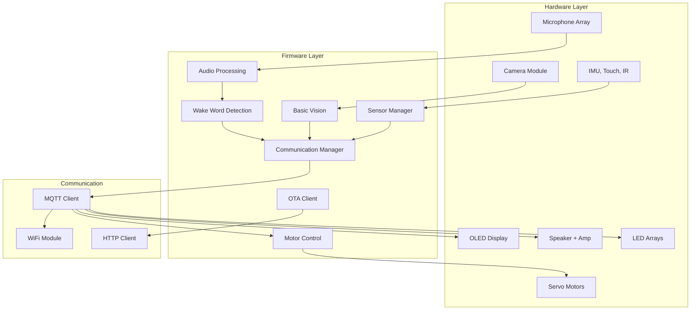
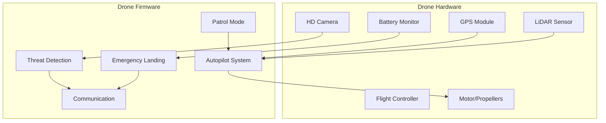
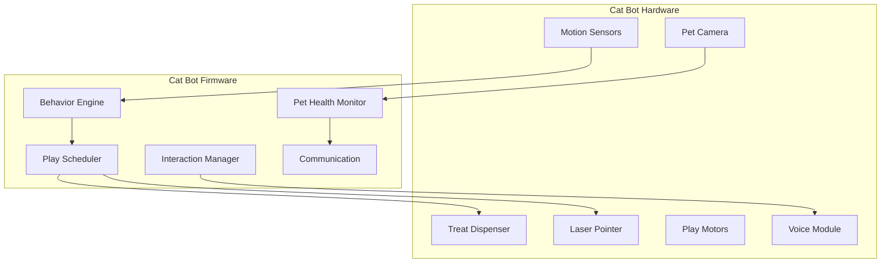
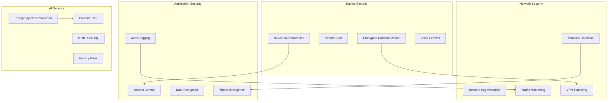
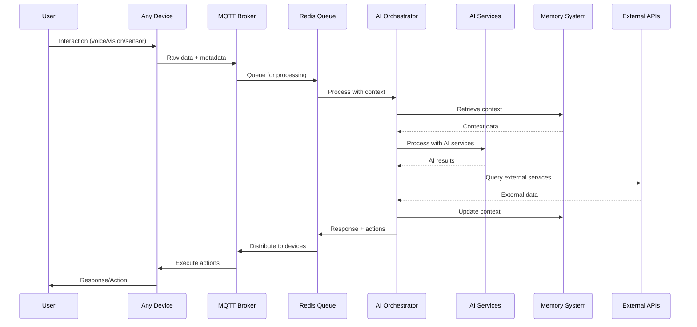

# NAILA Robot - Comprehensive Architecture Strategy

## Overview

This document outlines the complete architecture strategy for the NAILA robot ecosystem, extending from the basic prototype to a comprehensive AI orchestration system supporting multiple device types and advanced assistant capabilities.

## System Evolution Phases

### Phase 1: Core Robot (Current Prototype)
- Basic conversation and movement
- Local AI processing (STT, LLM, TTS, Vision)
- MQTT communication
- Wake word detection

### Phase 2: AI Orchestration Layer
- Personality development system
- Memory management and context retention
- Task planning and scheduling
- Security monitoring

### Phase 3: Extended Ecosystem
- Home security integration
- Drone management
- Cat companion robots
- Multi-device orchestration

## Comprehensive Architecture

```mermaid
graph TD
    subgraph "Device Layer"
        ROBOT[NAILA Robot - ESP32-S3]
        DRONES[Security Drones]
        CAT_BOTS[Cat Companion Bots]
        HOME_SENSORS[Home Security Sensors]
        CAMERAS[Security Cameras]
    end

    subgraph "Communication Layer"
        MQTT_BROKER[MQTT Broker - Mosquitto]
        REDIS[Redis - Message Queue]
        WEBSOCKET[WebSocket Server]
    end

    subgraph "AI Processing Layer"
        STT_SERVICE[STT Service - Whisper]
        VISION_SERVICE[Vision Service - YOLOv8]
        LLM_SERVICE[LLM Service - Llama 3]
        TTS_SERVICE[TTS Service - OuteTTS]
        FACE_RECOG[Face Recognition]
        EMOTION_DETECT[Emotion Detection]
    end

    subgraph "AI Orchestration Layer - LangGraph"
        ORCHESTRATOR[Central AI Orchestrator]
        PERSONALITY[Personality Engine]
        MEMORY_MGR[Memory Manager]
        TASK_PLANNER[Task Planner]
        SECURITY_MON[Security Monitor]
        TIME_MGR[Time Manager]
        CONTEXT_ROUTER[Context Router]
    end

    subgraph "Data Layer"
        VECTOR_DB[Vector Database - Chroma]
        CONTEXT_STORE[Context Store - PostgreSQL]
        DEVICE_REGISTRY[Device Registry]
        USER_PROFILES[User Profiles]
        SECURITY_LOGS[Security Logs]
    end

    subgraph "External Services"
        WEATHER_API[Weather API]
        CALENDAR_API[Calendar Integration]
        SMART_HOME[Smart Home APIs]
        NOTIFICATIONS[Notification Services]
        BACKUP_CLOUD[Cloud Backup]
    end

    subgraph "Management Layer"
        DEVICE_MGR[Device Manager]
        OTA_MGR[OTA Update Manager]
        HEALTH_MON[Health Monitor]
        CONFIG_MGR[Configuration Manager]
        ANALYTICS[Analytics Engine]
    end

    %% Device connections
    ROBOT --> MQTT_BROKER
    DRONES --> MQTT_BROKER
    CAT_BOTS --> MQTT_BROKER
    HOME_SENSORS --> MQTT_BROKER
    CAMERAS --> MQTT_BROKER

    %% Communication flow
    MQTT_BROKER --> REDIS
    REDIS --> ORCHESTRATOR
    ORCHESTRATOR --> WEBSOCKET

    %% AI Processing
    ORCHESTRATOR --> STT_SERVICE
    ORCHESTRATOR --> VISION_SERVICE
    ORCHESTRATOR --> LLM_SERVICE
    ORCHESTRATOR --> TTS_SERVICE
    ORCHESTRATOR --> FACE_RECOG
    ORCHESTRATOR --> EMOTION_DETECT

    %% Orchestration components
    ORCHESTRATOR --> PERSONALITY
    ORCHESTRATOR --> MEMORY_MGR
    ORCHESTRATOR --> TASK_PLANNER
    ORCHESTRATOR --> SECURITY_MON
    ORCHESTRATOR --> TIME_MGR
    ORCHESTRATOR --> CONTEXT_ROUTER

    %% Data storage
    PERSONALITY --> VECTOR_DB
    MEMORY_MGR --> CONTEXT_STORE
    TASK_PLANNER --> CONTEXT_STORE
    SECURITY_MON --> SECURITY_LOGS
    CONTEXT_ROUTER --> USER_PROFILES
    DEVICE_MGR --> DEVICE_REGISTRY

    %% External integrations
    ORCHESTRATOR --> WEATHER_API
    ORCHESTRATOR --> CALENDAR_API
    ORCHESTRATOR --> SMART_HOME
    ORCHESTRATOR --> NOTIFICATIONS
    ORCHESTRATOR --> BACKUP_CLOUD

    %% Management
    ORCHESTRATOR --> DEVICE_MGR
    ORCHESTRATOR --> OTA_MGR
    ORCHESTRATOR --> HEALTH_MON
    ORCHESTRATOR --> CONFIG_MGR
    ORCHESTRATOR --> ANALYTICS
```



## AI Orchestration with LangGraph

### Core Orchestration Graph

```python
# Conceptual LangGraph structure
class NAILAOrchestrator:
    def __init__(self):
        self.graph = StateGraph(NAILAState)
        
        # Add nodes
        self.graph.add_node("input_processor", self.process_input)
        self.graph.add_node("context_retriever", self.retrieve_context)
        self.graph.add_node("personality_filter", self.apply_personality)
        self.graph.add_node("security_check", self.security_check)
        self.graph.add_node("task_planner", self.plan_tasks)
        self.graph.add_node("response_generator", self.generate_response)
        self.graph.add_node("action_executor", self.execute_actions)
        self.graph.add_node("memory_updater", self.update_memory)
        
        # Define flow
        self.graph.add_edge("input_processor", "context_retriever")
        self.graph.add_edge("context_retriever", "personality_filter")
        self.graph.add_edge("personality_filter", "security_check")
        self.graph.add_conditional_edges(
            "security_check",
            self.security_router,
            {"safe": "task_planner", "unsafe": "response_generator"}
        )
        self.graph.add_edge("task_planner", "response_generator")
        self.graph.add_edge("response_generator", "action_executor")
        self.graph.add_edge("action_executor", "memory_updater")
```

### State Management

```python
class NAILAState(TypedDict):
    # Input data
    user_id: str
    device_id: str
    input_type: str  # audio, vision, sensor
    raw_data: bytes
    
    # Processed data
    text_input: str
    vision_results: Dict
    sensor_data: Dict
    
    # Context
    conversation_history: List[Dict]
    user_profile: Dict
    current_mood: str
    active_tasks: List[Dict]
    
    # Security
    security_level: str
    threat_detected: bool
    
    # Response
    response_text: str
    actions: List[Dict]
    tts_audio: bytes
    
    # Memory
    memory_updates: List[Dict]
    learning_points: List[Dict]
```

## Device-Specific Architectures

### NAILA Robot (ESP32-S3)



### Security Drones



### Cat Companion Robots



## Security Architecture

### Multi-Layer Security Model



## Data Flow Architecture

### Real-time Processing Pipeline



## Technology Stack

### Core Infrastructure
- **Message Broker**: Mosquitto MQTT
- **Message Queue**: Redis
- **Database**: PostgreSQL (context), Chroma (vectors)
- **Web Framework**: FastAPI
- **AI Orchestration**: LangGraph
- **Container**: Docker/Docker Compose

### AI Services
- **STT**: Faster-Whisper
- **LLM**: Llama 3 (via llama-cpp-python)
- **TTS**: OuteTTS
- **Vision**: YOLOv8, OpenCV
- **Embeddings**: Sentence-Transformers

### Device Firmware
- **ESP32**: ESP-IDF with C++
- **Communication**: MQTT client (Rust-based)
- **Security**: TLS/SSL encryption
- **Updates**: OTA via HTTP

## Deployment Architecture

### Development Environment
```yaml
services:
  mqtt-broker:
    image: eclipse-mosquitto:latest
    ports: ["1883:1883", "9001:9001"]
    
  redis:
    image: redis:alpine
    ports: ["6379:6379"]
    
  postgres:
    image: postgres:15
    environment:
      POSTGRES_DB: naila_context
      
  ai-server:
    build: ./ai-server
    depends_on: [mqtt-broker, redis, postgres]
    
  chroma:
    image: chromadb/chroma:latest
    ports: ["8000:8000"]
```

### Production Considerations
- High availability with load balancing
- Horizontal scaling of AI services
- Backup and disaster recovery
- Monitoring and alerting
- Security hardening

## Implementation Roadmap

### Phase 1: Core Robot (Months 1-3)
1. Basic MQTT communication
2. Core AI services (STT, LLM, TTS)
3. Simple personality system
4. Basic memory management

### Phase 2: Advanced AI (Months 4-6)
1. LangGraph orchestration
2. Enhanced personality development
3. Context-aware responses
4. Security monitoring

### Phase 3: Ecosystem Expansion (Months 7-12)
1. Drone integration
2. Cat companion robots
3. Home security system
4. Multi-device orchestration

### Phase 4: Advanced Features (Year 2)
1. Advanced emotion recognition
2. Predictive task planning
3. Cloud backup integration
4. Mobile app development

## Performance Targets

- **Response Latency**: <2 seconds for basic queries
- **Wake Word Detection**: <500ms
- **Device Communication**: <100ms MQTT roundtrip
- **Memory Retrieval**: <200ms for context queries
- **Concurrent Devices**: Support 10+ devices per instance
- **Uptime**: 99.9% availability target

## Monitoring and Analytics

### Key Metrics
- Device health and connectivity
- AI service performance
- User interaction patterns
- Security event tracking
- Resource utilization

### Alerting System
- Device offline alerts
- Security threat notifications
- Performance degradation warnings
- System health monitoring

This comprehensive architecture provides a scalable foundation for the NAILA robot ecosystem, supporting both current prototype needs and future expansion into a full AI-powered home automation and security system.