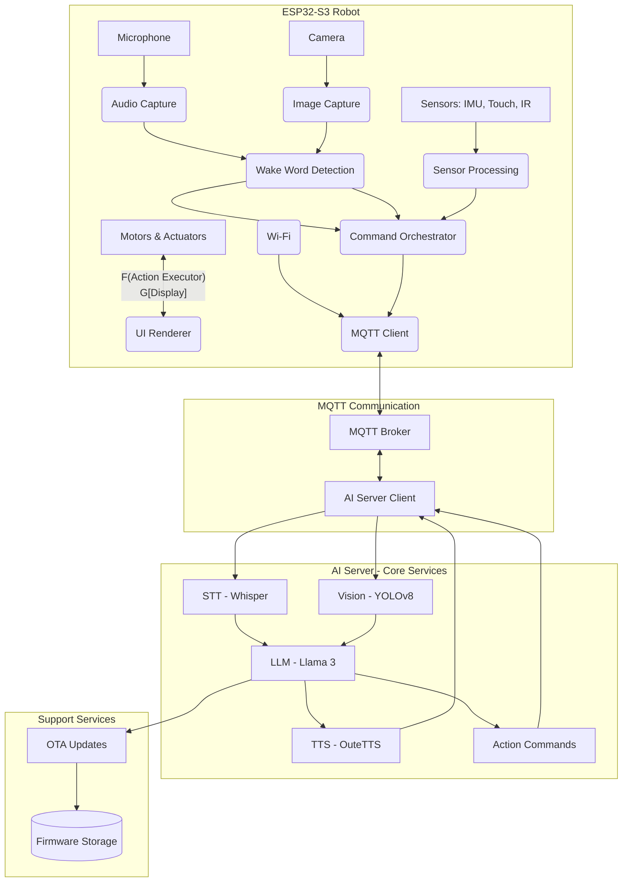
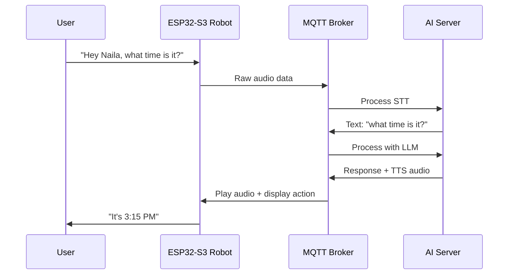

# NAILA Robot - Prototype Flow

## Core System Architecture



## Basic Interaction Flow



## MQTT Topics (Prototype)

```
naila/
├── robot/
│   ├── audio/raw          # Raw audio from microphone
│   ├── vision/raw         # Raw images from camera
│   ├── sensors/data       # Sensor readings
│   └── status/            # Robot status updates
├── ai/
│   ├── stt/result         # Speech recognition results
│   ├── vision/result      # Vision analysis results
│   ├── tts/audio          # Generated speech audio
│   └── actions/           # Action commands for robot
└── system/
    ├── ota/               # Over-the-air updates
    └── health/            # System health monitoring
```