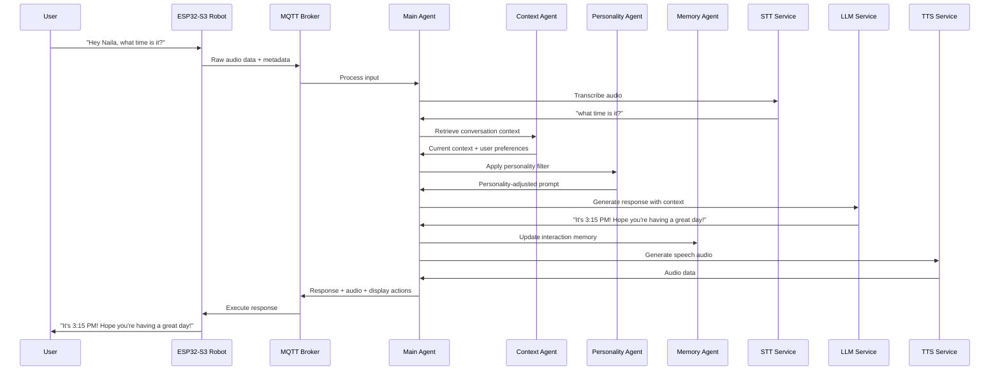

# NAILA Robot - Multi-Agent System Flow

## Multi-Agent System Architecture

```mermaid
graph TD
    subgraph "Hardware Layer"
        MIC[Microphone] --> AUDIO_PROC[Audio Processing]
        CAM[Camera] --> VISION_PROC[Vision Processing]
        SENSORS[Touch/IR Sensors] --> SENSOR_MGR[Sensor Manager]
        SERVOS[Servo Motors] <-- MOTOR_CTRL[Motor Control]
        DISPLAY[Screen] <-- DISPLAY_CTRL[Display Control]
        SPEAKER[Speaker] <-- AUDIO_OUT[Audio Output]
    end
    
    subgraph "Firmware Layer - ESP32-S3"
        AUDIO_PROC --> COMM_MGR[Communications Manager]
        VISION_PROC --> COMM_MGR
        SENSOR_MGR --> COMM_MGR
        COMM_MGR --> MQTT_CLIENT[MQTT Client]
        COMM_MGR --> OTA_CLIENT[OTA Client]
    end
    
    subgraph "Communication Infrastructure"
        MQTT_CLIENT <--> MQTT_BROKER[MQTT Server]
        MQTT_BROKER <--> HTTP_SERVER[HTTP Server]
        MQTT_BROKER <--> REAL_TIME[Real-time Data]
    end
    
    subgraph "AI Orchestration Layer"
        MAIN_AGENT[Main Agent] --> PERSONALITY[Personality Agent]
        MAIN_AGENT --> CONTEXT[Context Agent]
        MAIN_AGENT --> MEMORY[Memory Agent]
        MAIN_AGENT --> PLANNING[Planning Agent]
        MAIN_AGENT --> TOOLING[Tooling Agent]
    end
    
    subgraph "AI Processing Pipeline"
        STT[STT - Whisper] --> MAIN_AGENT
        LLM[LLM - Llama 3] <--> MAIN_AGENT
        TTS[TTS - OuteTTS] <-- MAIN_AGENT
        VISION[Vision - YOLOv8] --> MAIN_AGENT
        EMOTION[Emotion Detection] --> MAIN_AGENT
        FACE_RECOG[Face Recognition] --> MAIN_AGENT
    end
    
    subgraph "Knowledge & Memory"
        CONTEXT_STORE[Context Store] <--> CONTEXT
        VECTOR_DB[Vector Database] <--> MEMORY
    end
    
    subgraph "Web Services"
        LIVE_FEED[Live Feed] <-- HTTP_SERVER
        CONTROLS[Device Controls] <-- HTTP_SERVER
        LOGS[Historical Data] <-- HTTP_SERVER
        RESPONSE_GEN[Response Generation] <-- HTTP_SERVER
    end
    
    MQTT_BROKER --> MAIN_AGENT
    MAIN_AGENT --> MQTT_BROKER
    MOTOR_CTRL <-- MQTT_CLIENT
    DISPLAY_CTRL <-- MQTT_CLIENT
    AUDIO_OUT <-- MQTT_CLIENT
```

## Multi-Agent Interaction Flow



## MQTT Topics (Multi-Agent Architecture)

```
naila/
├── devices/
│   └── <device_id>/
│       ├── sensors/       # Sensor data and status
│       ├── audio/         # Audio stream data
│       ├── vision/        # Visual data and events
│       └── actions/       # Command execution confirmations
├── ai/
│   ├── processing/
│   │   ├── stt/           # Speech-to-text results
│   │   ├── vision/        # Computer vision analysis
│   │   └── agents/        # Inter-agent communication
│   ├── orchestration/
│   │   ├── main/          # Main agent coordination
│   │   ├── personality/   # Personality management
│   │   ├── context/       # Context tracking
│   │   ├── memory/        # Memory operations
│   │   ├── planning/      # Task planning
│   │   └── tooling/       # External tool integration
│   └── responses/
│       ├── audio/         # Generated speech audio
│       ├── actions/       # Device action commands
│       └── emotions/      # Emotional expressions
└── system/
    ├── health/            # System health monitoring
    ├── updates/           # OTA update notifications
    ├── security/          # Security events and alerts
    └── analytics/         # Performance and usage metrics
```